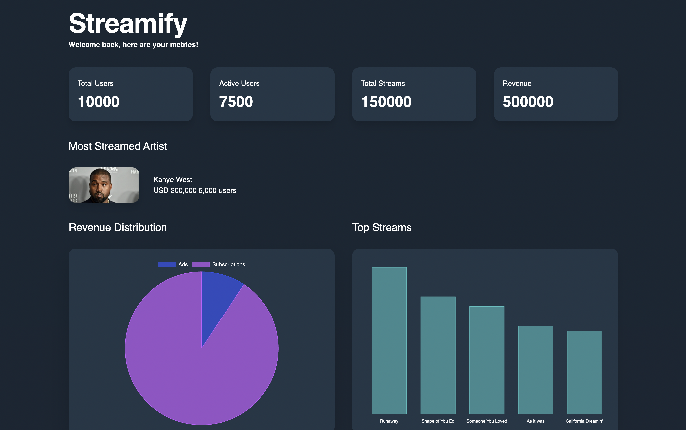

# Streamify

A frontend application that displays an analytics dashboard for a fictional music streaming service. The dashboard presents key metrics and data visualizations, allowing the service's management team to gain insights into user activity, revenue, and content performance. The goal was to build a functional and visually appealing dashboard that is both responsive and user-friendly.



## Table of Contents

1. [Introduction](#introduction)
2. [Features](#features)
3. [Installation](#installation)
4. [Running the App](#running-the-app)
5. [Additional Notes](#additional-notes)

## Introduction

This project is a web application that utilizes React on the frontend and Express on the backend. It serves as a robust example of how to integrate these two technologies to create a seamless full-stack experience.

## Features

- React for dynamic, interactive UI
- Express for a RESTful backend API
- TypeScript support for type safety
- Tailwind CSS for styling
- Material UI as component library
- React Query for fetching and caching data and error handling

## Installation

1. **Clone the repository:**

   ```bash
   git clone https://github.com/YashasaveeKesarwani99/streamify.git
   cd streamify
   ```

2. **Install dependencies for the frontend:**

   ```bash
   cd streamify-web
   npm install
   ```

3. **Install dependencies for the backend:**

   ```bash
   cd streamify-server
   npm install
   ```

## Usage

### Frontend

1. **Navigate to the `client` directory:**

   ```bash
   cd streamify-web
   ```

2. **Start the React development server:**

   ```bash
   npm run dev
   ```

   This will run the React app on `http://localhost:5173`.

### Backend

1. **Navigate to the `server` directory:**

   ```bash
   cd streamify-web
   ```

2. **Start the Express server:**

   ```bash
   npm run dev
   ```

   This will run the Express server on `http://localhost:3000`.

## Additional Notes

- A dashboard contains information, sometimes a lot of it. The user persona is such that it wants to see relevant data and it's visualization and leave other things that are distraction. `Usability` and `clarity` of the interface along with optimization of rendering it ( especially when data sensitive calls are being made to a server ) have been given the utmost importance while developing the application.

- **Design Layout** - The layout has been designed keeping in mind the psychology of the user. Important metrics like `total revenue` and `most streamed artist` have been given the hero section. Next comes the data visualization part. In the end I've kept the tabular data as it requires more than a quick view.

- **The implementation** - I've used react and typescript to form the basis of the frontend. Vite as the modular bundler. I've tried to give an MVC structure to the codebase ( not in the fullest sense, tho ).

- The data fetching, error throwing, caching and loading/pending status has been taken care by `react query`. The custom hook that I've made to fetch data acts as controller. the model/schema of response have been exported to `global.d.ts`. The view structure has been implemented through modular and clean code practices. I have divided the codebase into pages, the subsequent components and some atoms that are nothing but smallest reusable components.

- The data fetching is done with a `custom hook` which caching and an appropriate stale time to make efficient calls to our server. I have also created two other custom hooks for fetching current screen width ( helped in making the app responsive ) and for showing snackbar ( error handling in frontend ).

- I have used `materialUI` as it has lot of options, good documentation and also the bundle size is lesser than antd ( saying by a first hand experience and the community supports this opinion ).

- I have used `tailwindCSS` as the css library. My goto library as it has the best documentation, suggestive classes and again - lot of options.

- I haven't implemented a global state as the communications between the components were next to nothing. Although I had installed `recoil` initially but removed it from the package after seeing it's futility.

- I was going to implement unit testing with `vitest` and `react-testing-library` but unable to do it because of time constraint. I'll add that later.

- There was a minimal backend/server code to give our frontend a reality check by making calls to a real server. There also I've implemented an MVC structure.

- There would be many drawbacks in the application as it needs a thorough testing but I'm happy to say that it works right now. it's responsive too. I'm open to feedbacks!

## Logs

- Added lazy loading to few components that were not visible on the folder, this divded the js chunks hence improved the FCP. Also adding it to the components that were not on the top did not affect the CLS score.

- Added intersectiong observer to the elements that does not come in the folder of the page, this reduced the LCP.
